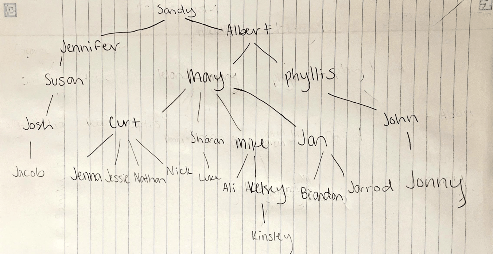

# Prolog Geneology Program

## Table of Contents

[Files Present](#files-present)

[How to Run](#how-to-run)

[Family Tree Photo](#family-tree-photo)

[Who-Did-What](#who-did-what)

[What I Learned](#what-i-learned)

## Files Present

database.pl 
- file containing the geneological database for my family
- holds the knowledge base for this program, contains only information about the child relation and age of each family member

predicates.pl 
- file containing the predicate definitions for the requested familial relations
- defines predicates for parent, sibling, nth cousin, nth cousin k-times-removed, grandparent, and kth child.

queries.pl
- file containing the two queries requested for this project: to find all pairs of nth cousins k times removed and to find all kth children of each parent

## How to Run

In a cmd window in the directory of the files, type

```
swipl
```

then run the following commands to reference the information in the database.pl and predicates.pl files:

```
consult("database.pl").
consult("predicates.pl").
```

## Family Tree Photo

Below I have included a photo of the family tree I created and referenced for this project, in case it is useful to reference while testing my code:



## Who-Did-What

My programming partner, Sara Williams, and I connected through groupme and determined we would work separately on the project but be resources for each other if we needed to ask any questions about the project. Therefore, this whole project was done by me. I did consult with her on whether or not she included spouses in the database for her family tree as I was struggling with my predicates returning duplicates due to each child having two parents in the tree. She said she did not include partners, so I was reassured that this was the best decision for me as well.

## What I Learned

I learned quite a bit while working on this project. First, I learned about prolog: both its syntax and how it can be used (specifically syntax for SWI Prolog). I had never heard of prolog before this class and project, so I had quite a bit of learning to do. I struggled a little bit in the beginning of this project with remembering some of the smaller details regarding prolog's syntax. I would often try to define a variable not using a capital letter and be frustrated for some time until I figured out that is what I did. I also figured out that prolog prefers if you define predicates for the same thing next to each other in the code. I specifically figured this out when trying to define the age and child relationships of my family. I started by defining both the age and child relationships for each subgroup in my family, but this gave me errors. So, I ended up defining the age for each person first and then all of the child relationships next. Once they were all together in the code, prolog did not have any issues with the file. There were definitely several other small syntax things with prolog that took me a second to get used to and that I have now learned and feel much more comfortable with. Also, reading through some of the documentation on SWI Prolog not only helped me to understand the syntax of the lanuage, but also helped me to learn some of the uses for SWI Prolog. Again, I had never heard of prolog so I certainly did not really know in what kind of applications it was used, but I was able to learn about some of its applications through reading about it. I found that very interesting, and it showed me that it is used for more types of applications than I thought.

The second thing I learned through this project was how to use prolog to define relationships among people, using previously defined relationships. The logic and thinking behind some of the relationships and expressing them using the prolog language was definitely a learning curve for me. Each predicate I defined took a lot more thought than one would think. Not only about how family relationships are defined, but also how to express this using a slightly limiting language. The Nth cousin and Nth cousin K times removed relationships were the most challenging for me. First, I do not think I ever knew the proper definition for these two familial relations, so wrapping my head around what they meant took a little bit at first. Then, defining these relationships using prolog and existing relationships I had defined was very difficult. I also learned a bit more about some of the built-in predicates prolog provides, such as setof().

Finally, this project forced me to get better using recursion, specifically using it to define familial relationships. I have never been a big fan of recursive functions, and will often look for another solution before using the recursive solution. However, this wasn't exactly possible for this project, so I was forced to gain a better understanding of how to define recursive relationships. Especially for the nth cousin and nth cousin k times removed relationships, recursion was necesary to define them. Figuring out the base case and then how to decrement towards that base case and recall the original relationship was hard to get my mind around at first, but I was able to eventually figure it out to define these relationships. I also struggled quite a bit with the recursive relationships and getting the error, "Arguments are not sufficiently instantiated" when trying to query with the variable K as opposed to giving K a value. I tried using the use_module(library(clpfd)) mentioned by another student in class, but this did not fix the issue for me. I determined that instead of assigning Knew is K - 1 before calling the predicate again with Knew, I was able to call the predicate with Knew and then assign K is Knew + 1. This allows the predicates to get the correct answers without throwing an error when the K value is not instantiated. I learned that everything after the is operator must already be instantiated, so doing it this way solves this problem and is still able to perform the recursive solution.